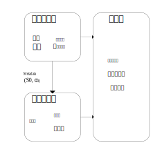

# Revision History

| Rev  | Description                          | Authers | Date      |
| ---- | ------------------------------------ | ------- | --------- |
| v0.1 | 编码器架构完整设计与解码器的初步定义 | 孙雪健  | 2025.7.13 |
|      |                                      |         |           |

[TOC]


# 1. Parameters

| Full Spelling | Abbreviations | Description |
| ------------- | ------------- | ----------- |
|               |               |             |
|               |               |             |
|               |               |             |


# 2. Overview

Huffman编码因其接近熵界的压缩效率，已成为无损压缩系统的核心组件。传统的FP16/BF16 量化与软件实现已难以满足性能瓶颈，本设计采用了一种结合 Bit‑Plane 分解的混合精度 Huffman 编解码器，面向FP16/FP8/FP4的LLM推理加速场景，力争低延迟与高吞吐的同时减小面积和功耗。

# 3. Interface


## 3.1 CMU-MXU Interface

**Interface Structure**

Name: `DsaRequest`

```c++

```

## 3.2 L2Xbar-MXU Interface


# 4. Micro Architecture Design

系统整体推理加速流程可划分为三个核心模块，分别完成压缩、传输与解压还原任务。系统总体结构如下图所示。

<center>
    
</center>

## 4.1 Encoder Unit

编码器的主要结构如图2所示，由五段流水段构成：符号统计、符号重排、熵感知判断与树构建、树深度调整，以及最终的码字判断输出环节。

<center>
    
</center>

### 4.1.1 Symbol Statistic Unit

### 4.1.2 Symbol Sort Unit

### 4.1.3 Entropy Calculating and Tree Builder Unit

### 4.1.4 Tree Adjuster Unit

### 4.1.5 Code Word Output Unit

## 4.2 Decode Unit


